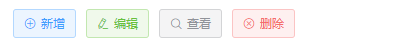
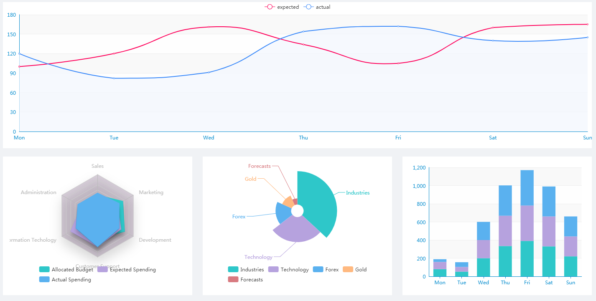
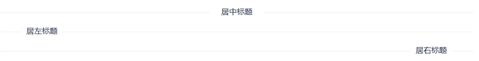
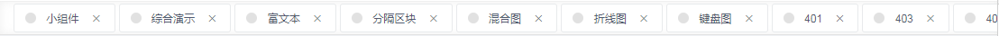
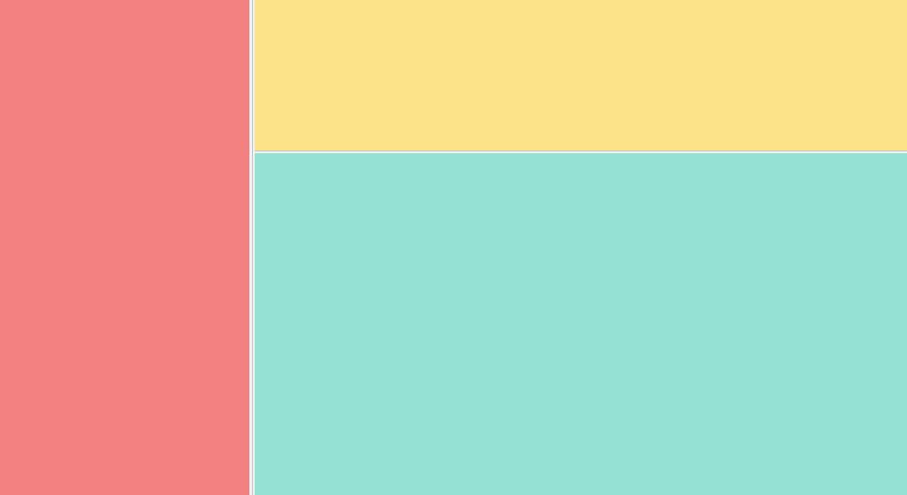
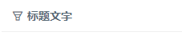

# 组件解析

## 1.基本资源

### 图标

本项目 Icon 图标，可以到 [iconfont](https://www.iconfont.cn/) 上选择并生成自己的业务图标库，再进行使用。

[本项目icon参考](https://wangbin3162.github.io/vue-admin-doc/font-demo/demo_fontclass.html)

**font-class引用**

在iconfont中挑选图标库后，下载font-class包，解压后会有fontclass代码

font-class是unicode使用方式的一种变种，主要是解决unicode书写不直观，语意不明确的问题。

与unicode使用方式相比，具有如下特点：

兼容性良好，支持ie8+，及所有现代浏览器。 相比于unicode语意明确，书写更直观。可以很容易分辨这个icon是什么。 因为使用class来定义图标，
所以当要替换图标时，只需要修改class里面的unicode引用。 不过因为本质上还是使用的字体，所以多色图标还是不支持的。 使用步骤如下：

第一步：拷贝项目下面生成的fontclass代码： //at.alicdn.com/t/font_8d5l8fzk5b87iudi.css

第二步：挑选相应图标并获取类名，应用于页面：

```html
<i class="iconfont icon-xxx"></i>
```
### 图表

管理后台图表也是常见得需求。这里图表就只推荐 ECharts，功能齐全，社区 demo 也丰富 [gallery](https://gallery.echartsjs.com/explore.html)。

我还是那个观点，大部分插件建议大家还是自己用 vue 来封装就好了，真的很简单。
ECharts 支持 webpack 引入，图省事可以将 ECharts 整个引入 var echarts = require('echarts') 不过 ECharts 还是不小的，
如果只使用它小部分功能或者图表类型的话建议按需引入。

```js
// 按需引入 引入 ECharts 主模块
var echarts = require('echarts/lib/echarts')
// 引入柱状图
require('echarts/lib/chart/bar')
// 引入提示框和标题组件
require('echarts/lib/component/tooltip')
require('echarts/lib/component/title')

//全部引入
var echarts = require('echarts')
```

接下来我们就要在 vue 中声明初始化 ECharts 了。因为 ECharts 初始化必须绑定 dom，
所以我们只能在 vue 的 mounted 生命周期里进行初始化。

```js
export default {
    mounted() {
      this.initCharts();
    },
    methods: {
      initCharts() {
        this.chart = echarts.init(this.$el);
        this.setOptions();
      },
      setOptions() {
        this.chart.setOption({
          title: {
            text: 'ECharts 入门示例'
          },
          tooltip: {},
          xAxis: {
            data: ["衬衫", "羊毛衫", "雪纺衫", "裤子", "高跟鞋", "袜子"]
          },
          yAxis: {},
          series: [{
            name: '销量',
            type: 'bar',
            data: [5, 20, 36, 10, 10, 20]
          }]
        })
      }
    }
}
```

就这样简单，ECharts 就配置完成了，这时候你想说我的 data 是远程获取的，或者说我动态改变 ECharts 的配置该怎么办呢？
我们可以通过 watch 来触发 setOptions 方法

```js
export default {
    //第一种 watch options变化 利用vue的深度 watcher，options 一有变化就重新setOption
    watch: {
      options: {
        handler(options) {
          this.chart.setOption(this.options)
        },
        deep: true
      }
    },
    //第二种 只watch 数据的变化 只有数据变化时触发ECharts
    watch: {
      seriesData(val) {
        this.setOptions({series:val})
      }
    }
}
```

## 2.基础工具

### common工具包

```js
/**
 * 时间格式化
 * @param time
 * @param cFormat
 * @returns {*}
 */
export function parseTime (time, cFormat) {
  if (arguments.length === 0) {
    return null
  }
  const format = cFormat || '{y}-{m}-{d} {h}:{i}:{s}'
  let date
  if (typeof time === 'object') {
    date = time
  } else {
    if (('' + time).length === 10) time = parseInt(time) * 1000
    date = new Date(time)
  }
  const formatObj = {
    y: date.getFullYear(),
    m: date.getMonth() + 1,
    d: date.getDate(),
    h: date.getHours(),
    i: date.getMinutes(),
    s: date.getSeconds(),
    a: date.getDay()
  }
  // eslint-disable-next-line
  const time_str = format.replace(/{(y|m|d|h|i|s|a)+}/g, (result, key) => {
    let value = formatObj[key]
    if (key === 'a') return ['一', '二', '三', '四', '五', '六', '日'][value - 1]
    if (result.length > 0 && value < 10) {
      value = '0' + value
    }
    return value || 0
  })
  // eslint-disable-next-line
  return time_str
}

/**
 * 数组插入函数
 * @param arr 数组
 * @param val 插入值
 * @param compare 比较函数,传入,判断是否存在插入值
 * @param maxLen 最大插入个数,不传即为max
 */
export function insertArray (arr, val, compare, maxLen) {
  const index = arr.findIndex(compare)
  // 如果当前插入的值就在第一个位置则啥都不做
  if (index === 0) {
    return
  }
  // 如果数组中有这条数据则删除这个
  if (index > 0) {
    arr.splice(index, 1)
  }
  arr.unshift(val)// 插入数据
  if (maxLen && arr.length > maxLen) {
    arr.pop()// 如果数组超出，则把最后一个给推出
  }
}

/**
 *  删除数据
 * @param arr 数组
 * @param compare 比较函数,传入,判断是否存在插入值
 */
export function deleteFromArray (arr, compare) {
  const index = arr.findIndex(compare)
  // 如果数组中有这条数据则删除这个
  if (index > -1) {
    arr.splice(index, 1)
  }
}

/**
 * 节流函数，延迟执行函数
 * @param func 延迟的函数类型
 * @param delay 延迟毫秒数
 * @return {Function} 返回一个执行函数
 */
export function debounce (func, delay) {
  let timer
  return function (...args) {
    if (timer) {
      clearTimeout(timer)
    }
    timer = setTimeout(() => {
      func.apply(this, args)
    }, delay)
  }
}

/**
 * 洗牌函数
 * @param arr 需要洗牌的数组
 * @return { 打乱次序的新数组 }
 */
export function shuffle (arr) {
  let newArr = arr.slice()// 复制一个新数组
  for (let i = 0; i < newArr.length; i++) {
    let j = getRandomInt(0, i)// 在0-当前循环的位置随机一个位置做交换
    let t = newArr[i]
    newArr[i] = newArr[j]
    newArr[j] = t
  }
  return newArr
}

/**
 * 在某个区间随机一个整数
 * @param min 最小值
 * @param max 最大值
 * @return {number}
 */
export function getRandomInt (min, max) {
  return Math.floor(Math.random() * (max - min + 1) + min)
}

/**
 * 清空回车换行符
 * @param str
 * @returns {*}
 */
export function replaceReturn (str) {
  return str ? str.replace(/(↵)+|(\n)+|(\r\n)+/g, '') : ''
}

/**
 * 返回一个水印canvas
 */
export function getWaterMark (str) {
  var waterMarkText = str || 'Kingdee'

  var canvas = document.createElement('canvas')
  var ctx = canvas.getContext('2d')
  canvas.width = canvas.height = 100
  ctx.textAlign = 'center'
  ctx.textBaseline = 'middle'
  ctx.globalAlpha = 0.08
  ctx.font = '20px Microsoft Yahei'
  ctx.translate(50, 50)
  ctx.rotate(-Math.PI / 4)
  ctx.fillText(waterMarkText, 0, 0)
  return canvas
}

```

```js
/**
 * Created by wangbin on 2018/2.27.
 */

/* 匹配合法文件相对路径 */
export function validateFilePath(str) {
  const reg = /^((\w+\/)*\w+\.html)$/
  return reg.test(str)
}

/* 匹配合法文件相对路径 */
export function validateFilePath2(str) {
  const reg = /^((\w+\/)*[a-zA-Z0-9+&%$#=~_-]+(\.\w+)*)$/
  return reg.test(str)
}

/* 小写字母 */
export function validateLowerCase(str) {
  const reg = /^[a-z]+$/
  return reg.test(str)
}

/* 大写字母 */
export function validateUpperCase(str) {
  const reg = /^[A-Z]+$/
  return reg.test(str)
}

/* 大小写字母 */
export function validateAlphabets(str) {
  const reg = /^[A-Za-z]+$/
  return reg.test(str)
}

/* 是否带有小数 */
export function isDecimal(strValue) {
  var objRegExp = /^\d+\.\d+$/
  return objRegExp.test(strValue)
}

/* 校验是否中文名称组成 */
export function ischina(str) {
  var reg = /^[\u4E00-\u9FA5]{2,64}$/
  return reg.test(str)
}

/* 匹配非中文编码 */
export function isNonChinese(str) {
  const reg = /^\w+$/
  return reg.test(str)
}

/* 校验正整数 */
export function isInteger(str) {
  var reg = /^\d+$/
  return reg.test(str)
}

/* 校验电话码格式 */
export function isTelCode(str) {
  var reg = /^((0\d{2,3}-\d{7,8})|(1[35874]\d{9}))$/
  return reg.test(str)
}

/* 校验邮件地址是否合法 */
export function isEmail(str) {
  var reg = /^([a-zA-Z0-9_\\.-])+@([a-zA-Z0-9_-])+(\.[a-zA-Z0-9_-])+/
  return reg.test(str)
}

//...
```

### 水波纹指令

封装水波纹指令，用于给按钮添加点击水波纹特效

水波纹指令主要实现
```js
import './waves.css'

export default {
  bind (el, binding) {
    el.addEventListener('click', e => {
      const customOpts = Object.assign({}, binding.value)
      const opts = Object.assign({
        ele: el, // 波纹作用元素
        type: 'hit', // hit点击位置扩散center中心点扩展
        color: 'rgba(0, 0, 0, 0.15)' // 波纹颜色
      }, customOpts)
      const target = opts.ele
      if (target) {
        target.style.position = 'relative'
        target.style.overflow = 'hidden'
        const rect = target.getBoundingClientRect()
        let ripple = target.querySelector('.waves-ripple')
        if (!ripple) {
          ripple = document.createElement('span')
          ripple.className = 'waves-ripple'
          ripple.style.height = ripple.style.width = Math.max(rect.width, rect.height) + 'px'
          target.appendChild(ripple)
        } else {
          ripple.className = 'waves-ripple'
        }
        switch (opts.type) {
          case 'center':
            ripple.style.top = (rect.height / 2 - ripple.offsetHeight / 2) + 'px'
            ripple.style.left = (rect.width / 2 - ripple.offsetWidth / 2) + 'px'
            break
          default:
            ripple.style.top = (e.pageY - rect.top - ripple.offsetHeight / 2 - document.body.scrollTop) + 'px'
            ripple.style.left = (e.pageX - rect.left - ripple.offsetWidth / 2 - document.body.scrollLeft) + 'px'
        }
        ripple.style.backgroundColor = opts.color
        ripple.className = 'waves-ripple z-active'
        return false
      }
    }, false)
  }
}
```
导出，将此js再main中引入可以自动引用，也可以使用自定义插件进行引入

```js
import waves from './waves'

const install = function (Vue) {
  Vue.directive('waves', waves)
}

if (window.Vue) {
  window.waves = waves
  Vue.use(install) // eslint-disable-line
}

waves.install = install
export default waves

```


## 3.富文本

富文本这里采用一个插件[Tinymce](https://www.tiny.cloud/docs/),这里采取自己封装的方式来实用，可以更加灵活和自如。

### 常见的富文本

- [quill](https://github.com/quilljs/quill) 图片操作不太友善。但是简单易使用

- [vue-quill-editor](https://surmon-china.github.io/vue-quill-editor/) 基于quill的vue插件，可以尝试。

- [wangEditor](http://www.wangeditor.com/) 一个国人开发的编辑器，简单易用

- [ckeditor](https://ckeditor.com/ckeditor-5/) `ckeditor` 也是一家老牌做富文本的公司。5.0版本最新，长相也挺好看。

- [百度 UEditor](https://github.com/fex-team/ueditor) 又丑又难用。不推荐，实在要用推荐使用第三方库`vue-ueditor-wrap`

- [vue-ueditor-wrap](https://github.com/HaoChuan9421/vue-ueditor-wrap) 基于vue封装的组件，相对配置简单，修复了一些bug.


### Tinymce

这里来简单讲一下在自己项目中使用 `Tinymce` 的方法。

首先，去官网下载最新的插件资源包，并放置在`public/static/tinymce` 文件夹下，并在`index.html`入口处添加全局引用
```html
    <script src="<%= BASE_URL %>static/tinymce/tinymce.min.js"></script>
```

:::tip 
由于目前使用 `npm` 安装 `Tinymce` 方法比较负责复杂而且还有一些问题(日后可能会采用该模式)且会大大增加编译的时间所以暂时不准备采用。👾
:::

**使用**: 由于富文本不适合双向数据流，所以只会 `watch` 传入富文本的内容一次变化，之后传入内容的变化就不会再监听了，如果之后还有改变富文本内容的需求。

可以通过 `this.refs.xxx.setContent()` 手动来设置。

源码也很简单，有任何别的需求都可以在[@/components/Tinymce](https://github.com/wangbin3162/vue-admin/tree/master/src/components/Tinymce/index.vue) 中自行修改。

```html
  <tinymce :height="400" v-model="content"></tinymce>
```
### tinymce-vue

`tinymce` 官方也在之前发布了 `vue` 版本的[tinymce-vue](https://github.com/tinymce/tinymce-vue)，帮你封装好了很多东西，但同时也相对的减少了灵活性，有兴趣的可以自行研究一下。

## 4.components基础组件

### ButtonBar

按钮组，封装了增删改查4个按钮，具体查看源码
[ButtonBar](https://github.com/wangbin3162/vue-admin/tree/master/src/components/ButtonBar/index.vue)



### Charts

示例演示封装图表组件
[Charts](https://github.com/wangbin3162/vue-admin/tree/master/src/components/Charts)

四个示例图表，即为首页展示区下方显示的图表



### Divider

分割线标题组件[Divider](https://github.com/wangbin3162/vue-admin/tree/master/src/components/Divider/Divider.vue)

```html
<divider>居中标题</divider>
<divider orientation="left">居左标题</divider>
<divider orientation="right">居右标题</divider>
```
显示如下:


### Drawer

抽屉组件，分为抽屉容器[Drawer](https://github.com/wangbin3162/vue-admin/tree/master/src/components/Drawer/Drawer.vue),
和抽屉内容[DrawerBox](https://github.com/wangbin3162/vue-admin/tree/master/src/components/Drawer/DrawerBox.vue)

```html
 <drawer v-model="dialogFormVisible" :status="dialogStatus" :btn-status="btnStatus"
            @on-create="createData" @on-update="updateData" width="60%" mask-close>
      <drawer-box v-if="dialogStatus!=='check'" type="edit">
        <!--...-->
      </drawer-box>
      <!--查看显示列表-->
      <drawer-box v-else>
        <div slot="display">
          <el-row>
            <el-col :span="24">
              <v-label blod>商品名称</v-label>
              <v-label>{{ goods.name }}</v-label>
            </el-col>
          </el-row>
          <!--...-->
        </div>
      </drawer-box>
```

分析，drawer抽屉包含主体布局，包括头部，底部按钮操作，遮罩层`mask-close`等，用于组装基本的抽屉，如下


其中 `width`参数为抽屉宽度百分比，默认撑满父容器，如设置小于100%则会生成一个遮罩层，开启 `mask-close`可以开启点击遮罩层关闭抽屉。

抽屉容器则比较简单，只是根据类型不同包裹不同的样式
```html
  <drawer-box v-if="dialogStatus!=='check'" type="edit">
        <!--嵌套的表格-->
  </drawer-box>
```

`type`属性默认为view，为view时则显示表格显示数据，具体显示见下方label使用嵌套，则会显示出类似下图的效果:


多行列表可以借助`element-ui`中的`el-row`，`el-col`来灵活拼装

### Label

文本组件[Label](https://github.com/wangbin3162/vue-admin/tree/master/src/components/Label/Label.vue),此组件仅用于显示在抽屉组件中的
显示列表中使用
```html
  <!--...-->
  <drawer-box v-else>
     <div slot="display">
       <el-row>
         <el-col :span="24">
           <v-label blod>商品名称</v-label>
           <v-label>{{ goods.name }}</v-label>
         </el-col>
       </el-row>
       <!--...-->
     </div>
  </drawer-box>
```

### ScrollPane

滚动组件[ScrollPane](https://github.com/wangbin3162/vue-admin/tree/master/src/components/ScrollPane/index.vue)

`TagsView.vue`中使用，主要是超出宽度页签可以滚动显示
```html
<scroll-pane class='tags-view-wrapper' ref='scrollPane'>
    <!--...-->
</scroll-pane>
```
显示如下:



### SplitPane

可调节组件[SplitPane](https://github.com/wangbin3162/vue-admin/tree/master/src/components/SplitPane/index.vue)

这部分不做详细说明，请参考源码，效果如下:



### TitleBar

标题组件[TitleBar](https://github.com/wangbin3162/vue-admin/tree/master/src/components/TitleBar/index.vue)

```html
   <title-bar label="标题文字" icon="icon-funnelplot"></title-bar>
```



### Layout

布局基础组件[Layout](https://github.com/wangbin3162/vue-admin/tree/master/src/components/Layout/Layout.vue)，
封装右侧`main-box`中的内容模块，其中主要封装了
[TreeBar](https://github.com/wangbin3162/vue-admin/tree/master/src/components/Layout/TreeBar/TreeBar.vue)，树容器
[FilterBar](https://github.com/wangbin3162/vue-admin/tree/master/src/components/Layout/FilterBar)，查询条件
[ContentBox](https://github.com/wangbin3162/vue-admin/tree/master/src/components/Layout/ContentBox)，内容显示等基础组件

具体请参考源码，使用时引入`Layout.vue`即可自动拼装一个有基本布局的内容


### el-scrollbar

`el-scrollbar`是`element-ui`的隐藏滚动条组件，样式美观，在开发layout,drawer，以及菜单栏部分都有使用到。非常简单易用。

```html
<el-scrollbar style="height: 100%;">
  <!--...-->
</el-scr
```

