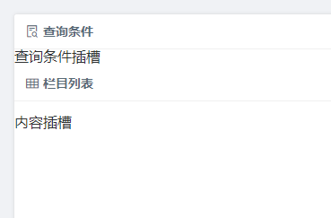
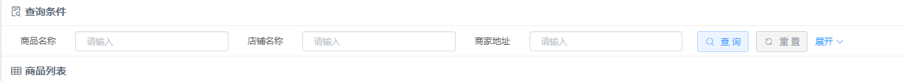

# 开始实现

上一章节介绍了项目的基础准备和相关的依赖添加，这一节就开始具体介绍一下如何一步一步来编写后台管理系统。

后台管理系统的主体样式参考[AntDesign](https://preview.pro.ant.design/dashboard/analysis),结合
[element-ui](http://element-cn.eleme.io/#/zh-CN/component/installation) 库可以实现出非常漂亮统一的后台管理系统。

## 从入口开始

项目的入口为src/main.js

先来看看长什么样子

```js
import Vue from 'vue'
import App from './App.vue'
import router from './router'
import store from './store'

Vue.config.productionTip = false

new Vue({
  router,
  store,
  render: h => h(App)
}).$mount('#app')
```

可以说非常精简了，话不多说，先来引入必备的组件。在`main.js`中引入以下组件和自定义的插件

```js
// ...
import ElementUI from 'element-ui'
import 'element-ui/lib/theme-chalk/index.css'
import './assets/styles/index.scss'
import MyPlugin from './plugin/MyPlugin'
// ...
Vue.use(ElementUI)
Vue.use(MyPlugin)
```

## Vuex管理

[vuex](https://vuex.vuejs.org/zh/guide/)是vue官方的全局状态管理，为了以后更方便的管理和使用，
我们把store.js单独拉倒一个文件夹store中来管理,修改后的store.js如下

```js
import Vue from 'vue'
import Vuex from 'vuex'
import app from './modules/app'
import tagsView from './modules/tagsView'

Vue.use(Vuex)

export default new Vuex.Store({
  state: {
    sidebar: state => state.app.sidebar,
    visitedViews: state => state.tagsView.visitedViews,
    cachedViews: state => state.tagsView.cachedViews
    // menuName: state => state.permission.menuName,
    // menuList: state => state.permission.menuList
  },
  modules: {
    app,
    tagsView
  }
})
```

其中，为了区分不同类型的状态，我们将不同类型的状态分别放置在app.js、tagsView.js中，统一放置在modules文件夹中引入
由于本简版的后台管理不涉及到菜单的动态绑定，故只留两个管理作为示例说明。


## Router管理

[Router](https://router.vuejs.org/zh/)是官方的路由管理，我们也单独拉一个router文件夹来管理路由相关的操作和配置
首先先改写一下我们的基础路由

```js
import Vue from 'vue'
import Router from 'vue-router'
import Main from '../views/Layout/Main'

Vue.use(Router)

/**
 * router自定义配置项
 * hidden: true                   如果设置true则左侧路由菜单隐藏
 * name:'router-name'             <keep-alive>使用必须设置 (must set!!!)
 * meta : {
    role: true                   设置是否有权限
    title: 'title'                当前路由的中文名称
    noCache: true                 如果fasle，页面将不会被缓存(默认为false)
    icon: 'icon-file-text'        当前菜单的图标样式，使用阿里iconfont
  }
 **/
// 基础路映射
const _401 = () => import(/* webpackChunkName: "errorPage" */ '../views/errorPage/401.vue')
const _403 = () => import(/* webpackChunkName: "errorPage" */ '../views/errorPage/403.vue')
const _404 = () => import(/* webpackChunkName: "errorPage" */ '../views/errorPage/404.vue')
const _500 = () => import(/* webpackChunkName: "errorPage" */ '../views/errorPage/500.vue')
const _home = () => import(/* webpackChunkName: "main" */ '../views/Layout/Home/index.vue')
// 业务路由映射
const _keyBoard = () => import(/* webpackChunkName: "charts" */ '../views/charts/KeyBoard.vue')
const _lineMarker = () => import(/* webpackChunkName: "charts" */ '../views/charts/LineMarker.vue')
const _mixChart = () => import(/* webpackChunkName: "charts" */ '../views/charts/MixChart.vue')
const _tableExample = () => import(/* webpackChunkName: "example" */ '../views/example/TableExample.vue')
const _richText = () => import(/* webpackChunkName: "example" */ '../views/example/RichText.vue')
const _splitPanel = () => import(/* webpackChunkName: "example" */ '../views/example/SplitPanel.vue')
export const constantRouterMap = [
  { path: '/404', component: _404, hidden: true },
  { path: '/401', component: _401, hidden: true },
  { path: '/403', component: _403, hidden: true },
  { path: '/500', component: _500, hidden: true },
  {
    path: '',
    component: Main,
    redirect: 'home',
    meta: { title: '首页', icon: 'icon-home' },
    children: [{
      path: 'home',
      component: _home,
      name: 'home',
      meta: { title: '首页', icon: 'icon-home', noCache: true }
    }]
  }
]
export const asyncRouterMap = [
  // 组件实例
  {
    path: '/example',
    component: Main,
    redirect: 'noredirect',
    meta: { title: '演示案例', icon: 'icon-deploymentunit' },
    children: [
      { path: 'tableExample', component: _tableExample, name: 'TableExample', meta: { title: '综合演示' } },
      { path: 'richText', component: _richText, name: 'RichText', meta: { title: '富文本' } },
      { path: 'splitPanel', component: _splitPanel, name: 'SplitPanel', meta: { title: '分隔区块' } }
    ]
  },
  // 图表演示
  {
    path: '/charts',
    component: Main,
    redirect: 'noredirect',
    meta: { title: '图表示例', icon: 'icon-areachart' },
    children: [
      { path: 'keyBoard', component: _keyBoard, name: 'KeyBoard', meta: { title: '键盘图' } },
      { path: 'lineMarker', component: _lineMarker, name: 'LineMarker', meta: { title: '折线图' } },
      { path: 'mixChart', component: _mixChart, name: 'MixChart', meta: { title: '混合图' } }
    ]
  },
  // 错误页面
  {
    path: '/errorPage',
    component: Main,
    redirect: 'noredirect',
    meta: { title: '错误页面', icon: 'icon-error' },
    children: [
      { path: 'page401', component: _401, name: 'Page401', meta: { title: '401' } },
      { path: 'page403', component: _403, name: 'Page403', meta: { title: '403' } },
      { path: 'page404', component: _404, name: 'Page404', meta: { title: '404' } },
      { path: 'page500', component: _500, name: 'Page500', meta: { title: '500' } }
    ]
  },
  { path: '*', redirect: '/404' }
]
export default new Router({
  base: process.env.BASE_URL,
  scrollBehavior: () => ({ y: 0 }),
  routes: constantRouterMap.concat(asyncRouterMap)
})

```

路由这块和页面展示息息相关，既然左侧的菜单栏和路由是动态板顶的，那则必须要遵循一定的规则，见上文注释部分

基础路由则需要包含home和errorPage，这里创建相关的vue集成组件，讲路由进行拆分组合，并将基础布局Layout进行拼接，我们可以得到如下的基础布局页面


如上图所示，页面整体布局如下

```html
 <!--views/Layout/Main.vue-->
 <div class="main-container">
      <!--nav-bar-->
      <nav-bar></nav-bar>
      <!--tags-->
      <tags-view></tags-view>
      <!--main-->
      <div class="app-main">
        <transition name="fade" mode="out-in">
          <keep-alive :include="cachedViews">
            <router-view></router-view>
          </keep-alive>
        </transition>
      </div>
    </div>
```
解释:
- MenuBar:路由嵌套的菜单栏，可收缩
- NavBar：嵌套一个动态面包屑导航的导航栏，包含欢迎词和avatar头像区域
- TagsView：当前开启的路由/菜单 这部分用到了vuex缓存的全局状态
- AppMain：主要工作区，这部分使用到了[keep-alive](https://cn.vuejs.org/v2/api/#keep-alive)

通过路由导航的工作区主要存在于keep-alive 管理的页面app-main区块内部，如目前看到的主体部分所显示的部分即是路由Home的主体显示

另外，我们再添加一个**路由拦截器**，用于做路由跳转时候进度控制和权限控制等细粒度操作。
```js
import router from './router'
import NProgress from 'nprogress'
import 'nprogress/nprogress.css'// progress bar style
// const debug = process.env.NODE_ENV !== 'production'
NProgress.configure({ showSpinner: false })// NProgress Configuration

// 权限白名单 no redirect whitelist
const whiteList = ['/home', '/404', '/401', '/403', '/500']

/**
 * 当前路由是否有权限
 * @param 当前路由名称
 * @returns {boolean}
 */
function hasPermission (route) {
  if (whiteList.indexOf(route.path) !== -1) { // 在免登录白名单，直接进入
    return true
  }
  return false
}

router.beforeEach((to, from, next) => {
  NProgress.start()
  // 如果有权限判断则进行筛选并跳转不同的权限页面
  next()
})

router.afterEach(() => {
  NProgress.done() // finish progress bar
})
```
在main.js中引入

先别着急着进行开发，下一节咱们来看看如何利用组件和已经存在的页面布局添加两个组件管理页面。

## 新增两个组件

这节来试试添加两个组件，并利用已经存在的布局将其渲染到页面上去

首先增加两个想要显示的功能模块如

    ├── views/example               // 实例代码
        │   ├── RichText            // 富文本测试页面
        │   └── SplitPanel          // 分隔窗口页面    
        
两个实例创建完毕后，我们为其创建对应的路由如下

```js
//...
const _richText = () => import(/* webpackChunkName: "main" */ '../views/example/RichText.vue')
const _splitPanel = () => import(/* webpackChunkName: "main" */ '../views/example/SplitPanel.vue')
//...
export const asyncRouterMap = [
  {
    path: '/example',
    component: Main,
    redirect: 'noredirect',
    meta: { title: '组件实例', icon: 'icon-gateway' },
    children: [
      { path: 'RichText', component: _richText, name: 'RichText', meta: { title: '富文本' } },
      { path: 'SplitPanel', component: _splitPanel, name: 'SplitPanel', meta: { title: '分隔区块' } }
    ]
  },
  {
      path: '/errorPage',
      component: Main,
      redirect: 'noredirect',
      meta: { title: '错误页面', icon: 'icon-error' },
      children: [
        { path: 'page401', component: _401, name: 'page401', meta: { title: '401' } },
        { path: 'page403', component: _403, name: 'page403', meta: { title: '403' } },
        { path: 'page404', component: _404, name: 'page404', meta: { title: '404' } },
        { path: 'page500', component: _500, name: 'page401', meta: { title: '500' } }
      ]
    },
  { path: '*', redirect: '/404' }
]
//...
```

创建路由完毕后，刷新页面，我们发现左侧根据路由生成了想要的页面，我们再次添加一个路由为错误页面


到此我们就完成了基本项目的构建，下一章节我们将会利用已经构建好的图标组件来组装我们的首页。

## 组装首页图表

图表我们使用[echarts](https://echarts.baidu.com/index.html),之前已经封装了一部分图表，这里咱们直接填充

填充完首页图表，另外新建三个演示图表，完成后如下图


## 来撸一个增删改查

后台管理最常见的莫过于树结构、列表、表单增删改查，为此特意实现一个综合案例的增删改查

再example文件夹中创建一个vue组件，这个文件夹会引用根据业务提炼出的layout布局，mixin混入，及小组件的拼装，下面一步步讲解

参考[源码](https://github.com/wangbin3162/vue-admin/blob/master/src/views/example/TableExample.vue)来查看具体的插槽插入位置

### 1.创建基本组件

创建一个TableExample放置于example中，并添加至路由表,由于通用样式已经写好并注入到基础组件中因此不需要再编写样式。

```html
<template>
  <div>TableExample</div>
</template>

<script>
  export default {
    name: 'TableExample'
  }
</script>
```

添加完后应该是这样的


重点来了，这个文件会引入不少自定义的 **布局组件** 布局组件参考组件解析

我们先引入一个mixin.js 这个js包含了基础的拼装组件、公共的自定义方法和默认的数据等

```vue
<template>
  <layout content-label="栏目列表">
  </layout>
</template>

<script>
  import { commonMixin } from '../../common/js/mixin.js'

  export default {
    name: 'TableExample',
    mixins: [commonMixin],
  }
</script>
```

### 2.插入第一个布局层Layout

如上引入layout后默认就会生成一个布局，这个布局非常简单



这个帮你创建了一个条件-列表页面并生成了若干插槽，并可以配置列表显示文字为‘栏目列表’,为了完整演示，我们给这个实例再增加一个树形结构
即再layout中添加一个have-tree我们看看会发生什么

```html
<layout have-tree content-label="栏目列表"></layout>
```


此时页面里有三个插槽，我们只要往对应插槽中插入即可

### 3.插入树插槽

插入树插槽
```html
 <tree-bar slot="tree" ref="tree" :tree-data="treeData" @current-change="handTreeCurrentChange"></tree-bar>
```
插入后如需要监听当前节点选中后做什么操作则可以监听`@current-change` 案例演示只log当前节点

这里插入一个知识点，由于数据都为前后分离，这里所有的数据都是用 [easy-mock](https://easy-mock.com/login) 模拟出来

这里配置请求后返回树节点

### 4.插入查询条件

```html
 <filter-bar slot="filter" :is-opended="filterOpened">
       <filter-item title="商品名称">
         <el-input v-model.trim="listQuery.name" size="mini" placeholder="请输入" clearable></el-input>
       </filter-item>
       <filter-item title="店铺名称">
         <el-input v-model.trim="listQuery.shop" size="mini" placeholder="请输入" clearable></el-input>
       </filter-item>
       <filter-item title="商家地址">
         <el-input v-model.trim="listQuery.address" size="mini" placeholder="请输入" clearable></el-input>
       </filter-item>
       <!--添加查询按钮位置-->
       <filter-item :show-toggle="true" :is-opended="filterOpened" @reset-query="resetQuery"
                    @search-click="handleFilter" @filter-toggle="filterOpened=!filterOpened"></filter-item>
       <filter-item title="商品种类">
         <el-input v-model.trim="listQuery.category" size="mini" placeholder="请输入" clearable></el-input>
       </filter-item>
       <filter-item title="商品描述">
         <el-input v-model.trim="listQuery.desc" size="mini" placeholder="请输入" clearable></el-input>
       </filter-item>
 </filter-bar>
```

插入后如下图



`:is-opended="filterOpened" ` 用来控制查询条件的展开和收起，需要添加两个事件来监听查询`@search-click="handleFilter"`
和重置`@reset-query="resetQuery"`按钮的点击

### 5.插入按钮组和表格和分页 

```html
    <!--ctrl插入-->
    <button-bar slot="ctrl" :optCode="{add:true,modify:true,remove:true}"
                @handleCreate="handleCreate" @handleEdit="handleEdit"
                @handleCheck="handleCheck" @handleDelete="handleDelete"></button-bar>
    <!--列表table-->
    <table-box @resize-height="_resizeTableHeight">
      <el-table size="mini" highlight-current-row border
                v-loading="listLoading" :data="list" :max-height="tabMaxSize"
                @row-dblclick="handleRowDoubleClick" @current-change="handleCurrentRowChange">
            <!--table内容省略...-->
          </template>
        </el-table-column>
      </el-table>
    </table-box>
    <pagination-bar :current-page="listQuery.page" :total="total" :page-size="listQuery.size"
                    @size-change="handleSizeChange" @current-change="handleCurrentChange">
    </pagination-bar>
```

插入后如下


此时需要依次对插入的按钮组做事件监听，表格的数据来源也需要初始化，pagination-bar复制粘贴即可，对应需要的时间及data都已在mixin.js中封装。

### 8.插入编辑页

编辑页借助了抽屉组件drawer,使用见组件解析

```html
    <!--编辑页-->
    <drawer v-model="dialogFormVisible" :status="dialogStatus" :btn-status="btnStatus"
            @on-create="createData" @on-update="updateData" width="60%" mask-close>
      <!--添加form表单-->
      <drawer-box v-if="dialogStatus!=='check'" type="edit">
        <!--嵌套的表格-->
        <el-form :model="goods" ref="dataForm" label-width="120px" size="small" status-icon
                 :rules="rules">
          <el-form-item label="商品名称" prop="name">
            <el-input v-model.trim="goods.name" clearable placeholder="请输入商品名称"></el-input>
          </el-form-item>
          <el-form-item label="店铺名称" prop="shop">
            <el-input v-model.trim="goods.shop" learable placeholder="请输入店铺名称"></el-input>
          </el-form-item>
          <el-form-item label="商家地址" prop="address">
            <el-input v-model.trim="goods.address" learable placeholder="请输入商家地址"></el-input>
          </el-form-item>
          <el-form-item label="商品种类" prop="category">
            <el-select v-model="goods.category" placeholder="请选择商品种类">
              <el-option label="零食" value="零食"></el-option>
              <el-option label="日用品" value="日用品"></el-option>
            </el-select>
          </el-form-item>
          <el-form-item label="商品描述" prop="desc">
            <el-input type="textarea" v-model="goods.desc"></el-input>
          </el-form-item>
        </el-form>
      </drawer-box>
      <!--查看显示列表-->
      <drawer-box v-else>
        <div slot="display">
          <el-row>
            <el-col :span="24">
              <v-label blod>商品名称</v-label>
              <v-label>{{ goods.name }}</v-label>
            </el-col>
          </el-row>
          <el-row>
            <el-col :span="24">
              <v-label blod>店铺名称</v-label>
              <v-label>{{ goods.shop }}</v-label>
            </el-col>
          </el-row>
          <el-row>
            <el-col :span="24">
              <v-label blod>商品类型</v-label>
              <v-label>{{ goods.category }}</v-label>
            </el-col>
          </el-row>
          <el-row>
            <el-col :span="24">
              <v-label blod>商品类型</v-label>
              <v-label>{{ goods.address }}</v-label>
            </el-col>
          </el-row>
          <el-row>
            <el-col :span="24">
              <v-label blod>商品描述</v-label>
              <v-label>{{ goods.desc }}</v-label>
            </el-col>
          </el-row>
        </div>
      </drawer-box>
    </drawer>
```


抽屉组件包含抽屉的box，根据dialogStatus来区分是哪种类型的编辑窗口，check查看，create新增，update编辑，对应默认插槽插入对应内容。

## 完成一个功能实现

至此，我们完成了一个基础模块的增加和实现，对于部分引用到的组件、资源和一些常用的第三方库的介绍和解释请继续看下一章。


